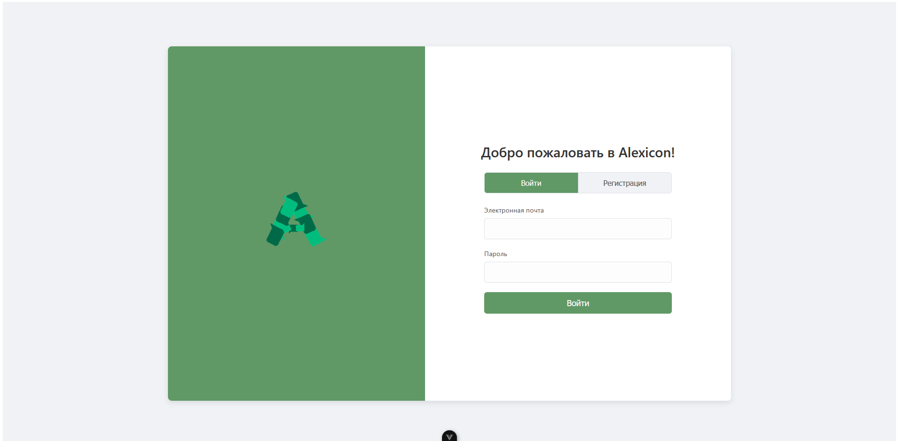
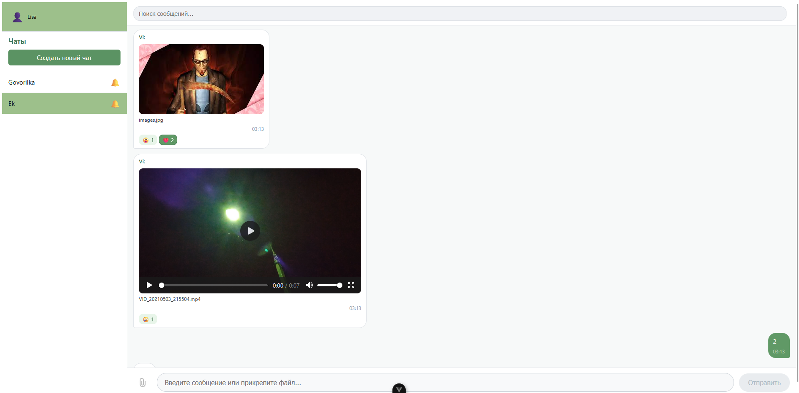

# Мессенджер Alexicon
Веб-мессенджер на Vue.js + Node.js

## Функционал проекта
1. Реализация системы регистрации и аутентификации пользователей.
2. Возможность отправки текстовых сообщений в реальном времени (использование WebSocket).
3. Поддержка создания групповых чатов.
4. Функциональность обмена медиафайлами (изображения, видео).
5. Хранение истории сообщений и возможность их поиска.
6. Поддержка реакции на сообщения (лайки, эмодзи).
7. Возможность настройки уведомлений для каждого чата.

## Пример работы приложения
Страничка авторизации/регистрации

Страничка с чатами


## Инструкция по запуску проекта

Для работы требуется установленный Node.js.

### 1. Сервер (Backend)

```bash
cd backend
npm install
node server.js
```

### 2. Клиент (Frontend)

```bash
cd frontend
npm install
npm run dev
```
